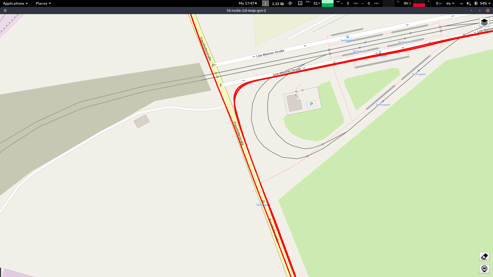

# ld-node-novatel-gnss-ins-2

[](https://gitlab.com/link.developers/ld-node-novatel-gnss-ins-2/commits/master)

## Motivation and Context

An application to retrieve positional and inertial data from Novatel OEM4 and OEMV series of devices. It is suited ideally for OEMV receivers equipped with SPAN technology.
The NovAtel Propak V3 device communicates via a serial protocol. We use a library internally which faciliates communication with the Novatel Device and provides C++ wrappers for common functions which are needed for interacting with the device.   
This node will write GNSS position estimates based on WSG84 standard on the mesh. It will also provide incremental updates to acceleration and gyroscopic data. This node supplies 3 offers called GPSMeasurement, AccelerationData, GyroscopeData and they are defined as below: 

```
//Supplies positional estimate.
table GPSMeasurement 
{
    gps_week : int32;         // GPS Week number (gps timestamp)
    gps_millisecs : int64;    // Milliseconds into week (gps timestamp)
    timestamp: int64;         // ns since Unix Epoch (system timestamp)
    latitude: double;         // degrees, S<0, N>0
    longitude: double;        // degrees, W<0, E>0
    altitude: double;         // metres
}

//If the device is unable to provide a good position estimate, it is 
//reflected in this supply.
table GPSBadSolution
{
    gps_week : int32;         // GPS Week number (gps timestamp)
    gps_millisecs : int64;    // Milliseconds into week (gps timestamp)
    timestamp: int64;         // ns since Unix Epoch (system timestamp)
    GPSBadSolution: int32;    // Mirrors the enum SolutionStatus. 
}

table AccData
{
    gps_week : int32;         // GPS Week number (gps timestamp)
    gps_millisecs : int64;    // Milliseconds into week (gps timestamp)
    timestamp: int64;         // ns since Unix Epoch
    accownX: int64;           // INS Longitudinal Acceleration (along y axis)
    accownY: int64;           // INS Lateral Acceleration (along x axis)   
    accownZ: int64;           // INS Vertical Acceleration (along z axis) 
}

table GyrData
{
    gps_week : int32;         // GPS Week number (gps timestamp)
    gps_millisecs : int64;    // Milliseconds into week (gps timestamp)
    timestamp: int64;         // ns since Unix Epoch (system timestamp)
    gyrownX: int64;           // RollRate About y axis rotation
    gyrownY: int64;           // PitchRate About x axis rotation
    gyrownZ: int64;           // YawRate About z axis rotation (Right Handed)
}
```

### Hardware setup
The setup consists of an OEMV receiver attached to a GNSS antenna and an Inertial Navigation System(INS) using an IMU. This application was tested against a setup with Novatel Propak V3 enclosure which consists of an OEMV3 receiver, connected to an HG1700 AG58 IMU and a GPS antenna. A serial to USB converter would be needed if you want to connect your laptop to the novatel device. To check for correct installation of the device and its configuration and set-up, it is advised to download the NovAtel Connect application available from [here.](https://www.novatel.com/products/firmware-options/novatel-connect/) The tool only works on Windows. It worked well on Windows 10. After connection from the Connet application, try basic commands like `LOG BESTPOS ONTIME 1` and check if data is received from the device. In case you have trouble running the node, please make sure that you are able to interact with the device using this native application.

### Configuration

#### BaudRate
The BaudRate is necessary for the novatel library to connect to the hardware. If you work with given Novatel Propak V3, **115200** is the right value.

#### SerialPortAddress
The SerialPortAddress is OS and machine dependent but on windows it is always a *COM* port and on unix systems it is always a *dev/ttyS~* port. On Linux, after you have inserted the USB cable to your laptop, try `dmesg | grep tty` to find the name of the serial port which you will use for the this parameter.

#### EnableIMU
If IMU data is also needed. Look at the supply to better understand what is available.

#### EnableBadSolutionStatus
If set to `true`, the node will write a table called GPSBadSolution which contains the data field called solutionStatus on the mesh. Values used are from the "SolutionStatus" enum shown below. The values are mapped from [SPAN Technology for OEMV User Manual Rev 11, Pg 148](https://www.novatel.com/assets/Documents/Manuals/om-20000104.pdf). This would help for debugging this gnss node in situations where it is not working properly or producing too many errors in position estimates. If you set this configuration parameter to `true`, don't forget to subscribe to `l2offer:/GPSBadSolution#/SolutionStatus`.

```
enum SolutionStatus
{
    SOL_COMPUTED,         //solution computed
    INSUFFICIENT_OBS,     //insufficient observations
    NO_CONVERGENCE,       //noconvergence
    SINGULARITY,          //singularity at parameters matrix
    COV_TRACE,            //covariance trace exceeds maximum (trace>1000m)
    TEST_DIST,            //test distance exceeded (max of 3 rejections 
                          //if distance > 10km)
    COLD_START,           //not yet converged from cold start
    V_H_LIMIT,            //height or velocity limits exceeded
    VARIANCE,             //variance exceeds limits
    RESIDUALS,            //residuals are too large
    DELTA_POS,            //delta position is too large
    NEGATIVE_VAR,         //negative variance
    INTEGRITY_WARNING=13, //large residuals make position unreliable
    INS_INACTIVE,         //ins has not started yet
    INS_ALIGNING,         //ins doing its coarse alignment
    INS_BAD,              //ins position is bad
    IMU_UNPLUGGED,        //no imu detected
    PENDING,              //when a fix position command is entered, 
                          //the receiver 
                          //computes its own position and determines if the fixed 
                          //position is valid
    INVALID_FIX,          //the fixed position entered using the 
                          //fix position command is not valid
	UNAUTHORIZED
};
```


#### GNSSRateHz
Defines the sampling frequency in **Hz** for the GPS data reception from the device. There is a limit of 5 Hz if EnableIMU is set to true. 20 Hz otherwise. These limits are manufacturer established and cannot be changed.

#### FileLogging
Basic information about the node is always recorded in a file even if this configuration is set to false. What this configuration actually does is, enables detailed logging for the data that is received from the novatel device. It would generate a pretty heavy log file when enabled, especially if IMU data is also being recorded. 

## The node in action
When connected to ld-node-2D-map-gui-2:


## Installation

```
conda install ld-node-novatel-gnss-ins-2
```

## Usage example

For Linux: 
```
sudo ./ld-node-novatel-gnss-ins-2 --instance-file instance.json 

```
The `sudo` is important, because on Linux root privileges are required to access ports used for serial communication. 

## Specification

This node implements the following RFCs:
- 

## Contribution

Your help is very much appreciated. For more information, please see our [contribution guide](./CONTRIBUTING.md) and the [Collective Code Construction Contract](https://gitlab.com/link.developers/RFC/blob/master/001/README.md) (C4).

## Maintainers

- Ritwik Ghosh (maintainer, original author)
